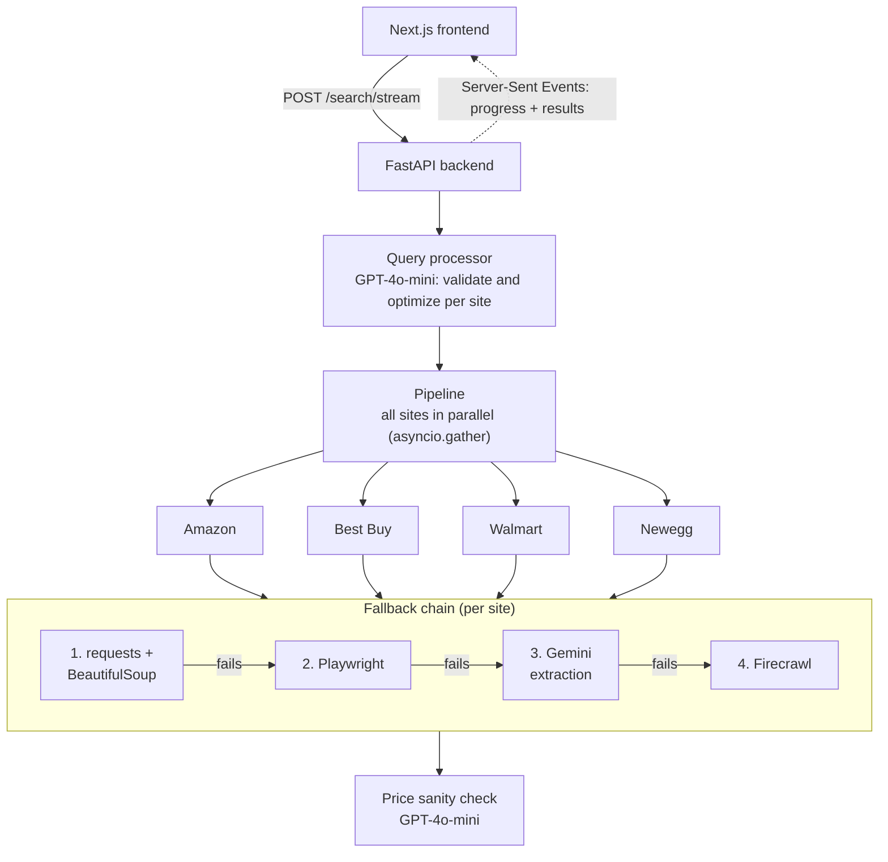

<div align="center">

# 🛒 ShopScan

**Real-time price comparison across Amazon, Best Buy, Walmart, and Newegg, with a 4-stage scraping fallback that keeps working when sites fight back.**


<!-- Add a screenshot or GIF of a search in progress here, e.g.:
 -->

</div>

## About

Type a product, and ShopScan searches four major retailers in parallel, streams results in as each site finishes, and highlights the best price.

Scraping real e-commerce sites is unreliable: pages change, requests get blocked, CAPTCHAs appear. So each site goes through a chain of four increasingly robust methods, and the first one that succeeds wins.

## Features

- **Four retailers searched in parallel:** Amazon, Best Buy, Walmart, and Newegg.
- **4-stage fallback per site:**
  1. HTTP request + BeautifulSoup parsing, which is fast and cheap
  2. A headless browser (Playwright) with CAPTCHA and geo-block detection and a pooled browser
  3. An LLM (Google Gemini) that extracts product data from the raw page text
  4. The Firecrawl API with structured extraction, as a last resort
- **LLM query optimization:** GPT-4o-mini validates the search and rewrites it into the best query for each retailer.
- **Price sanity check:** an LLM flags prices that look implausible for the product.
- **Live progress:** results stream to the browser over Server-Sent Events, so fast sites don't wait for slow ones.
- **Comparison UI:** best-price badge, price difference between retailers, ranking, and sort tabs.
- **Suggestions:** recommends a complementary product, and clicking it runs a second search below the first.
- **Graceful degradation:** a site that fails doesn't break the page. Each result also shows which method retrieved it.

## Architecture



## Tech stack

| Layer | Technologies |
| --- | --- |
| Frontend | Next.js 16, React 19, TypeScript, Tailwind CSS |
| Backend | Python, FastAPI, asyncio |
| Scraping | requests, BeautifulSoup, Playwright, Firecrawl |
| AI | OpenAI GPT-4o-mini, Google Gemini |

## Running locally

**Requirements:** Python 3.10+, Node.js 20+, and API keys for OpenAI, Google Gemini, and Firecrawl.

```bash
git clone https://github.com/ofriv/ShopScan.git
cd ShopScan

# Backend
cd backend
python -m venv .venv
.venv\Scripts\activate          # macOS/Linux: source .venv/bin/activate
pip install -r requirements.txt
playwright install chromium
cp .env.example .env            # then add your API keys
uvicorn main:app                # http://localhost:8000

# Frontend (in a second terminal)
cd frontend
npm install
npm run dev                     # http://localhost:3000
```

> **Windows note:** don't run uvicorn with `--reload`. Its file watcher switches Python to an event loop that can't launch Playwright's browser, so the browser scraper would fail. Restart the server manually after code changes instead.

## Project structure

```
├── backend/
│   ├── main.py              # FastAPI routes, including the SSE stream
│   ├── pipeline.py          # Parallel search and fallback orchestration
│   ├── query_processor.py   # Query optimization, price check, suggestions
│   ├── models.py            # Pydantic models
│   └── scrapers/
│       ├── basic.py         # requests + BeautifulSoup
│       ├── browser.py       # Playwright
│       ├── llm.py           # Gemini extraction
│       └── firecrawl.py     # Firecrawl API
└── frontend/
    ├── app/                 # Next.js App Router pages
    ├── components/          # Product cards, results, skeleton loaders
    └── hooks/useSearchSlot.ts   # Search state and SSE streaming
```

## What I'd improve next

- **Result caching,** so repeated searches don't re-scrape every site
- **Automated tests** for each scraper, run against saved HTML pages so they don't depend on live sites
- **Cloud deployment.** The Playwright stage needs a server that can run a browser, which rules out typical serverless hosting.

## License

[MIT](LICENSE)
